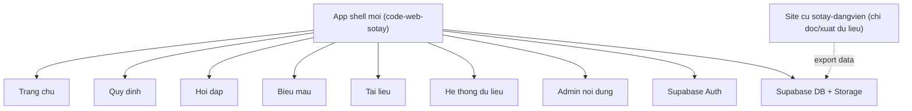

# Ke hoach xay moi module So tay tren nen code-web-sotay

## Muc tieu

Xay moi phan `tcddvhn.id.vn` ben trong nen `code-web-sotay`, khong sua code dang chay cua repo `sotay-dangvien` trong giai doan xay dung moi.

Nguyen tac:

- `code-web-sotay` la nen ky thuat chinh.
- `sotay-dangvien` chi la nguon tham chieu nghiep vu, giao dien va du lieu can xuat ra de migrate.
- Khong sua, khong trien khai lai, khong cat nguon site cu trong qua trinh xay moi.
- Neu can, chi `xuat du lieu` tu he cu de phuc vu migrate.

## San pham dich cuoi cung

Domain dich cuoi cung:

- `https://tcddvhn.id.vn`

Nen chay:

- app moi xay tren `code-web-sotay`

Site cu:

- giu nguyen de van hanh trong suot qua trinh xay dung

## Pham vi giao dien nguoi dung

He thong moi co 6 muc dieu huong chinh:

1. `Trang chu`
2. `Quy dinh`
3. `Hoi dap`
4. `Bieu mau`
5. `Tai lieu`
6. `He thong du lieu`

### Desktop

Menu chinh hien du 6 muc.

### Mobile

Bottom nav giu 5 muc So tay nhu he cu:

1. `Trang chu`
2. `Quy dinh`
3. `Hoi dap`
4. `Bieu mau`
5. `Tai lieu`

`He thong du lieu` di vao bang `menu phu`.

## Route de xuat

### User-facing routes

- `/`
- `/quy-dinh`
- `/quy-dinh/:slug`
- `/hoi-dap`
- `/hoi-dap/:slug`
- `/bieu-mau`
- `/bieu-mau/:slug`
- `/tai-lieu`
- `/tai-lieu/:slug`
- `/search`
- `/he-thong-du-lieu`

### Admin routes

- `/admin`
- `/admin/quy-dinh`
- `/admin/hoi-dap`
- `/admin/bieu-mau`
- `/admin/tai-lieu`
- `/admin/he-thong-du-lieu`

## Phan tich he cu sotay-dangvien

Nhung thanh phan dang ton tai trong repo cu:

- giao dien SPA DOM thuan trong `index.html`, `styles.css`, `app.js`
- du lieu noi dung chinh dang luu theo cay trong Firestore document `sotay/dulieu`
- admin content editor da co san
- Firebase Auth cho admin noi dung
- Google Apps Script cho:
  - thong bao
  - chatbot
  - khao sat / gop y
  - thong ke
- bo PDF viewer va tai lieu tinh

Nhung diem can giu lai ve trai nghiem:

- 5 muc dieu huong mobile cua So tay
- tim kiem nhanh tai trang chu
- khu `Quy dinh`, `Hoi dap`, `Bieu mau`, `Tai lieu`
- PDF viewer / mo tai lieu nguon
- giao dien va luong admin content

Nhung diem nen thay the hoan toan:

- Firebase Auth -> Supabase Auth
- Firestore treeData -> schema quan he tren Supabase
- Apps Script -> giai phap moi theo tung pha

## Kien truc moi de xuat

### Tong the

App moi van la mot ung dung React/Vite/Supabase.

So tay duoc xay thanh mot module noi dung moi ben trong app hien tai.

He thong du lieu hien co giu nguyen, dua vao route rieng va menu phu mobile.

### So do tong quan

## Cau truc component/page de xay moi

### Shell va layout

- `src/handbook/HandbookAppShell.tsx`
- `src/handbook/components/HandbookTopBar.tsx`
- `src/handbook/components/HandbookBottomNav.tsx`
- `src/handbook/components/HandbookSecondaryMenu.tsx`

### Pages user

- `src/handbook/pages/HomePage.tsx`
- `src/handbook/pages/RegulationsPage.tsx`
- `src/handbook/pages/FaqPage.tsx`
- `src/handbook/pages/FormsPage.tsx`
- `src/handbook/pages/DocumentsPage.tsx`
- `src/handbook/pages/SearchPage.tsx`

### Pages admin

- `src/handbook/admin/AdminDashboardPage.tsx`
- `src/handbook/admin/RegulationsAdminPage.tsx`
- `src/handbook/admin/FaqAdminPage.tsx`
- `src/handbook/admin/FormsAdminPage.tsx`
- `src/handbook/admin/DocumentsAdminPage.tsx`

### Services

- `src/handbook/services/handbookContent.ts`
- `src/handbook/services/handbookAdmin.ts`
- `src/handbook/services/handbookSearch.ts`
- `src/handbook/services/handbookStats.ts`

## Schema Supabase de xuat cho So tay

### 1. Bang noi dung goc

`handbook_nodes`

Cot de xuat:

- `id uuid/text primary key`
- `legacy_id text`
- `parent_id text null`
- `section text check in ('quy-dinh','hoi-dap','bieu-mau','tai-lieu')`
- `title text not null`
- `slug text`
- `tag text`
- `summary_html text`
- `detail_html text`
- `sort_order integer not null default 0`
- `level integer not null default 0`
- `file_url text`
- `file_name text`
- `pdf_refs jsonb not null default '[]'::jsonb`
- `force_accordion boolean not null default false`
- `is_published boolean not null default true`
- `created_at timestamptz`
- `updated_at timestamptz`
- `updated_by text`

### 2. Bang thong bao

`handbook_notices`

- `id`
- `title`
- `content`
- `published_at`
- `is_published`
- `created_by`

### 3. Bang gop y / khao sat

`handbook_feedback`

- `id`
- `kind`
- `rating`
- `content`
- `created_at`
- `created_by`

### 4. Bang lich su tim kiem

`handbook_search_logs`

- `id`
- `query`
- `results_count`
- `created_at`
- `created_by`

### 5. Bang thong ke doc

`handbook_view_logs`

- `id`
- `node_id`
- `section`
- `created_at`
- `viewer_key`

### 6. Bang danh dau yeu thich

`handbook_favorites`

- `id`
- `user_email`
- `node_id`
- `created_at`

### 7. Bang da xem gan day

`handbook_recent_views`

- `id`
- `user_email`
- `node_id`
- `last_viewed_at`

### 8. Bang token thong bao neu can

`handbook_push_tokens`

- `id`
- `user_email`
- `token`
- `device_label`
- `updated_at`

## Mapping du lieu tu he cu

He cu dang co 1 cay noi dung lon trong Firestore:

- collection/doc: `sotay/dulieu`
- truong chinh: `treeData`

Can viet script export + flatten thanh danh sach node.

### Mapping section tu tag cu

Quy tac de xuat:

- tag chua `hoi dap` -> `hoi-dap`
- tag chua `bieu mau` -> `bieu-mau`
- tag chua `tai lieu` -> `tai-lieu`
- con lai -> `quy-dinh`

Neu mot node co tag mo ho:

- dua vao bang `migration review`
- review tay truoc khi publish

### Du lieu can migrate

- `title`
- `tag`
- `summary`
- `detail`
- `fileUrl`
- `fileName`
- `pdfRefs`
- `pdfPage`
- `children`
- thu tu node trong cay

## Ke hoach migrate

### Pha A - Khong dong vao site cu

- doc cau truc Firestore tu he cu
- xuat `treeData` thanh JSON
- luu file xuat ngoai repo cu hoac trong repo moi duoi dang artifact migration

### Pha B - Flatten du lieu

- viet script chuyen cay -> bang
- tao:
  - `legacy_id`
  - `parent_id`
  - `level`
  - `sort_order`
  - `section`
  - `slug`

### Pha C - Import vao Supabase

- insert vao `handbook_nodes`
- kiem tra:
  - tong so node
  - tong so node theo section
  - node khong co parent hop le
  - node chua map duoc section

## Ke hoach trien khai theo pha

### Pha 1 - Shell giao dien

Muc tieu:

- tao khung app cho So tay trong `code-web-sotay`
- chua can migrate du lieu that

Cong viec:

- them layout user
- them 5 tab mobile
- them menu phu mobile
- them entry `He thong du lieu`

### Pha 2 - Schema + data adapter

Muc tieu:

- co schema Supabase cho So tay
- co script migration

Cong viec:

- viet SQL bang moi
- viet script flatten
- import du lieu mau

### Pha 3 - Xay trang doc noi dung

Muc tieu:

- hien thi du lieu So tay tu Supabase

Cong viec:

- Trang chu
- Quy dinh
- Hoi dap
- Bieu mau
- Tai lieu
- Search

### Pha 4 - Xay quan tri noi dung

Muc tieu:

- thay admin editor cu bang admin editor moi tren React

Cong viec:

- CRUD node
- move / reorder
- edit summary/detail
- file/pdf refs
- publish/unpublish

### Pha 5 - Tich hop phan chuc nang phu

Muc tieu:

- thay dần cac thanh phan Apps Script

Cong viec:

- notice
- feedback/survey
- view stats
- chatbot

## Rui ro chinh va cach giam rui ro

### 1. Rui ro lam hong site cu

Giai phap:

- khong sua repo cu
- khong sua deploy cu
- chi xuat du lieu

### 2. Rui ro sai map section

Giai phap:

- map tag tu dong
- lap danh sach node mo ho de review tay

### 3. Rui ro admin editor moi khong dat nhu he cu

Giai phap:

- xay pha doc noi dung truoc
- admin editor lam sau, theo bo tinh nang uu tien

### 4. Rui ro giao dien mobile khac thoi quen cu

Giai phap:

- giu 5 muc So tay tren bottom nav
- `He thong du lieu` dua vao menu phu dung theo yeu cau

## Quyet dinh da chot

- Xay moi tren nen `code-web-sotay`
- Khong dong vao site cu trong qua trinh xay dung
- Giao dien user co 6 muc chinh
- Mobile giu 5 muc So tay, `He thong du lieu` vao bang menu phu
- Admin co khu quan tri chung cho:
  - `Quy dinh`
  - `Hoi dap`
  - `Bieu mau`
  - `Tai lieu`
  - `He thong du lieu`
- Du lieu cu se duoc xuat va migrate sang Supabase

## Buoc tiep theo de bat dau code that

1. Tao shell route + layout cho module So tay trong app moi
2. Them schema SQL cho `handbook_*`
3. Viet script export/flatten du lieu tu he cu
4. Import mau mot phan du lieu va render trang doc dau tien
